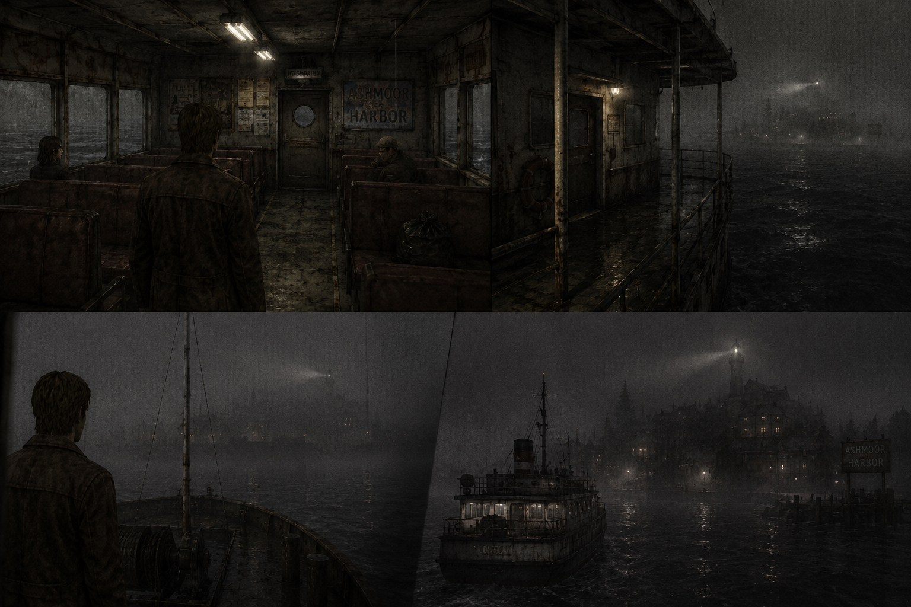
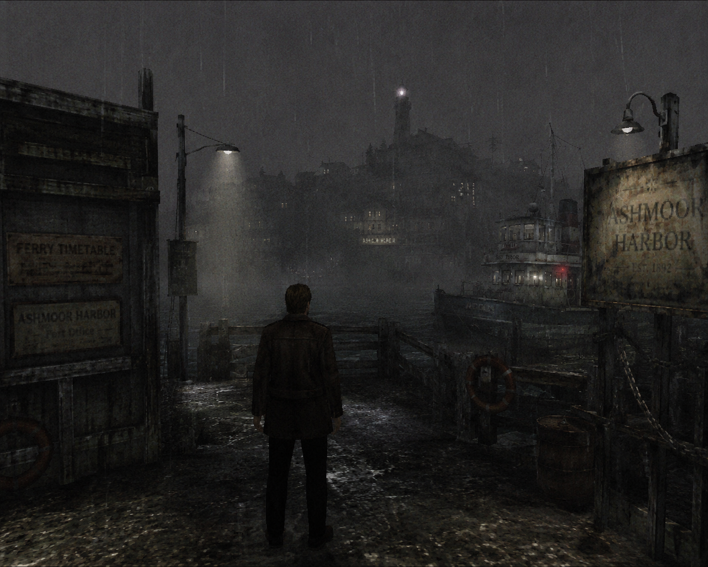
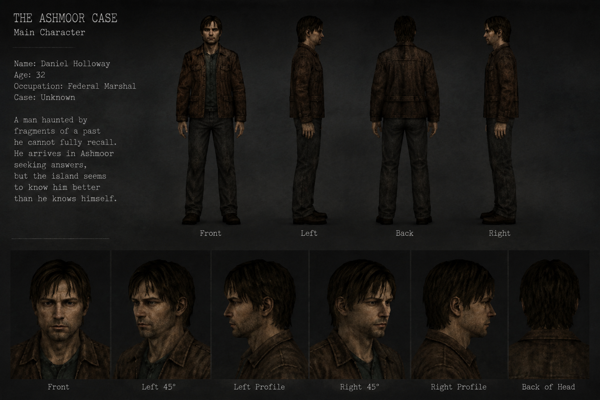

# Cineris
Cineris is the name of the game engine I’m developing for The Ashmoor Case. It’s a custom-built engine designed to give me full control over the rendering pipeline, game architecture, and overall development process. Cineris means “ashes” in Latin, for me, the name represents the idea of building something new from previous experiences

# The Ashmoor Case

The Ashmoor Case is my first game development project. A personal journey into the world of game creation.
I’ve always wanted to learn how games are made, and this project marks the beginning of that dream.

Inspired by one of my favorite films, Shutter Island, The Ashmoor Case will explore mystery, psychological tension, and atmosphere. It will combine cinematic storytelling with interactive gameplay.

# About the Project

This project is both a learning experience and the foundation for a full game.
I’m building everything from scratch using C++, OpenGL, and GLFW, to understand how rendering, shaders, and game architecture truly work.

The goal for The Ashmoor Case is to create a dark, grounded world with a sense of realism — not photorealistic, but believable enough to immerse the player.
The focus is on mood, lighting, and subtle environmental storytelling, evoking a feeling of unease and curiosity rather than relying on exaggerated or stylized visuals.

## References
If the description above doesn’t fully capture the mood, here are some visual references I generated to explore the atmosphere in more detail.

> Visual inspiration only — these are not in-game screenshots or final previews.

| Ambient 1 | Ambient 2 | Main Character |
|---|---|---|
|  |  |  |

> Generated with ChatGPT and used only as visual inspiration.

## Resources

I plan to create some of the textures, models etc... but some of them are from:
- https://ambientcg.com/

I also plan to create some music for this project.
